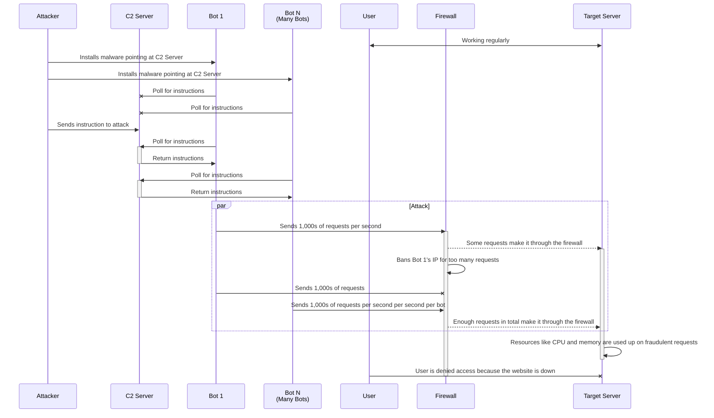

# Distributed Denial of Service Attack

This diagram describes what happens during a Distributed Denial of Service (DDoS) attack.

## Actors

* The `Attacker` represents the hacker that is organizing the DDoS.
* The `C2` actor represents the Command & Control website that the `Attacker` has set up in advance. This is how the `Attacker` pushes instructions to many bots at the same time without having to know all their IP addresses.
* `Bot 1` represents a single computer being used by the `Attacker`. Most often the computer isn't owned by the `Attacker` and is instead owned by a regular person.
* `Bot N` represents many bots that the `Attacker` has control over so the diagram is more concise. This can anywhere from dozens to millions of computers.
* `User` represents normal users that use the server for its designed purpose.
* `Firewall` can be either software or hardware designed to reduce and in some cases prevent the harm caused by malware. It can prohibit access to a server for many different reasons. In this case the firewall is stopping computers based on their IP.
* `Target Server` represents the website or server that is being targeted by the DDoS attack. This could be a media platform like Facebook or a server provider like Dyn.

## Setup

The setup phase is everything that happens before the actual DDoS attack. This includes installing the malware on the host computers and issuing the command of who to attack and when to start the attack.

## Attack

The attack phase is indicated by the parallel box `[Attack]`. This is when the attack begins and the bots start flooding the target with requests that will eat up resources necessary to run the page. During this phase, the requests from all of the bots are coming in nearly simultaneously. The firewall can recognize that a specifics IP has made too many requests in a short period of time and ban them. Before the bot is banned though, they manage to get a number of requests through to the actual server. When hundreds of bots do this, the amount of requests adds up very quickly. This is what eventually causes the `Target` server to overload and crash.

## Impact

The normal user requests can no longer be processed by the server because it has exhausted all its resources. This can appear in the form of a website not finishing loading or becoming unresponsive.

## Reasons for a DDoS Attack

There are many reasons a DDoS attack may be launched. They can include;

* Competition:
A business may try to crash a competitor to show how lacking their security is are or to force customers to look to their company for service.
* Political Reasons:
If a person doesn't agree with a site's policy or their motivations they might try to issue a DDoS attack as a form of protest.
* Financial Reasons:
The attacker may hold the site for random, forcing the victim to pay to stop the DDoS attack.

### Sources Used for Research

[What is a firewall?](https://www.youtube.com/watch?v=kDEX1HXybrU) by PowerCert Animated Videos  
[DDoS Attack Explained](https://www.youtube.com/watch?v=ilhGh9CEIwM) by PowerCert Animated Video  
[FBI Jobs](https://fbijobs.gov/majorcase/situation-two/index.html#:~:text=Command%20and%20Control%20Servers%20(C2%20Servers)%20are%20commonly%20used%20for,%2C%20network%20shutdowns%2C%20and%20more.)  
[DoS and DDoS Attacks Explained](https://www.youtube.com/watch?v=mMtRcWStrfw) by CyberPlatter
